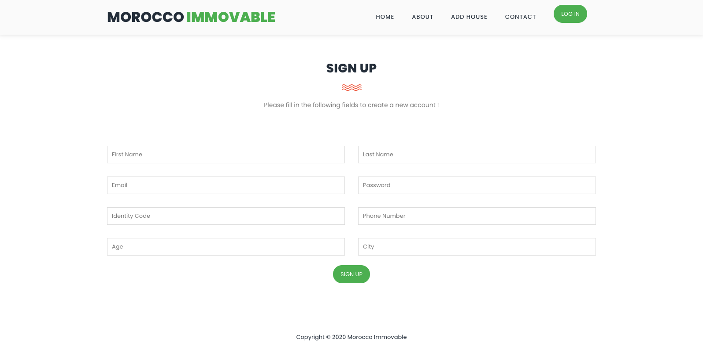
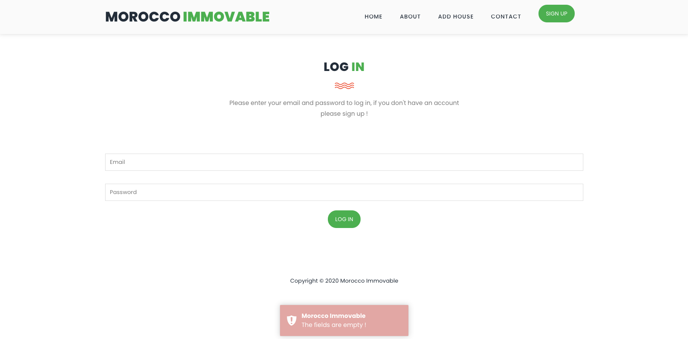
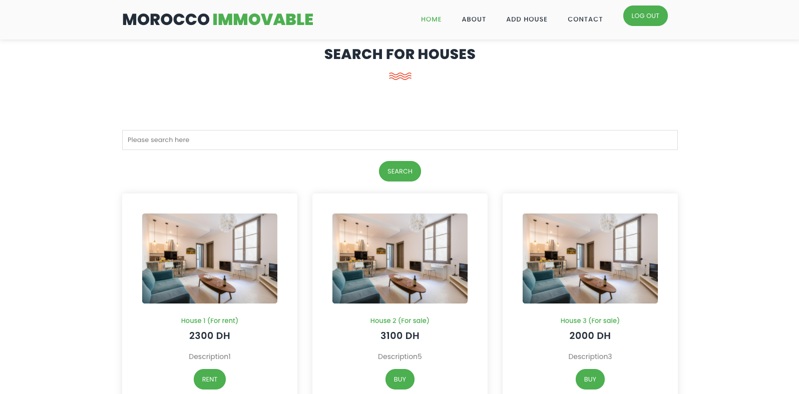
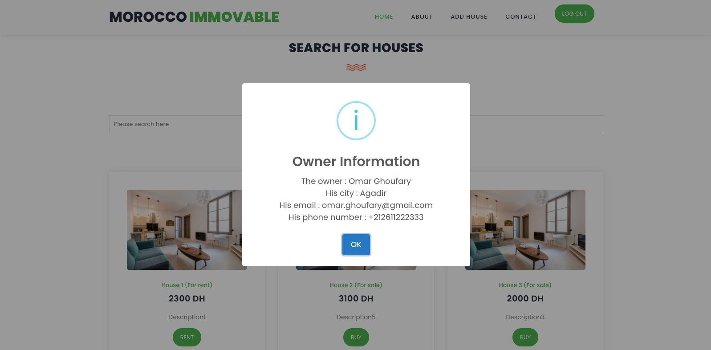
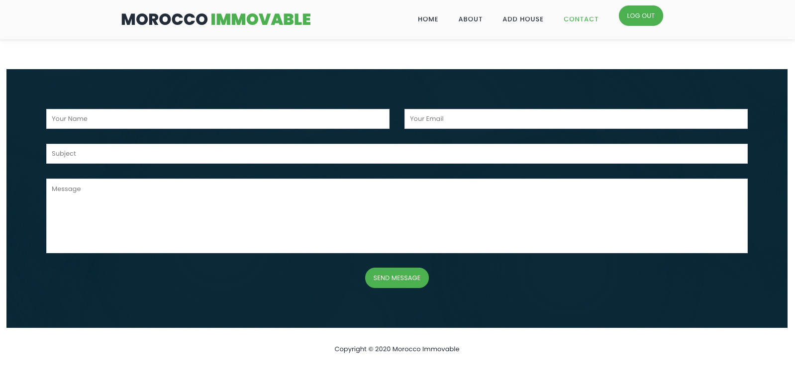
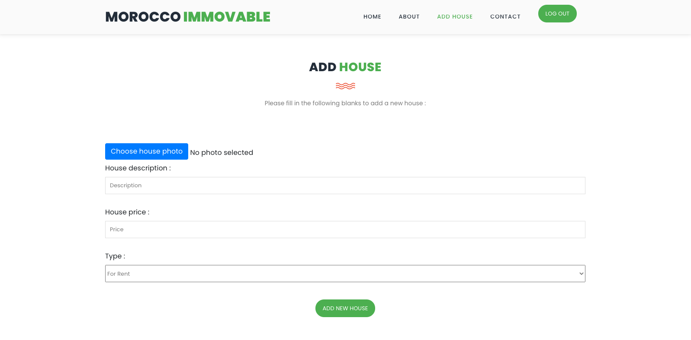
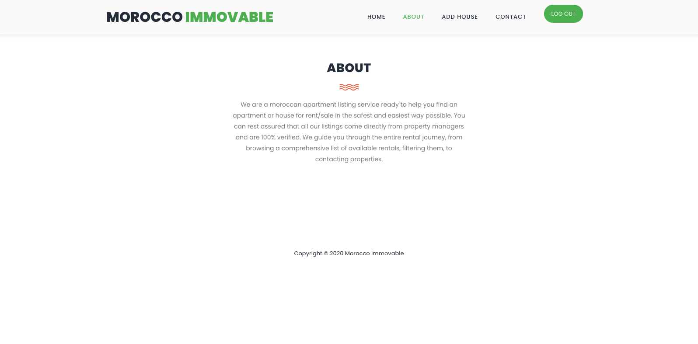

# MoroccoImmovable
> A property rental portal web application


## Description
This project is a property rental portal web application where the user can register and log in, then he can add a new house if he wants to sell it or offer it for renting, otherwise he can search for available houses, and contact their owners.

## Built With
* [Moshi](https://github.com/square/moshi)
* [Javalin](https://javalin.io)
* [PostgreSQL](https://www.postgresql.org)
* [Fusionauth-jwt](https://github.com/FusionAuth/fusionauth-jwt)
* [Axios](https://github.com/axios/axios)
* [JQuery](https://jquery.com)
* [Bootstrap](https://getbootstrap.com)
* [Toastr.js](https://github.com/CodeSeven/toastr)

## Screenshots

>Register :


>Log in :


>Search For Houses :


>Show owner information :


>Contact us :


>Add a new house :


>About :


## How To Run

+ Install IntelliJ IDEA IDE : https://www.jetbrains.com/idea
+ Install JDK 8 : https://www.oracle.com/java/technologies/javase/javase-jdk8-downloads.html
+ Install PostgreSQL : https://www.postgresql.org/
+ Create database tables (use the queries from the file database.sql) :
```sql
CREATE DATABASE morocco_immovable;

DROP TABLE IF EXISTS users;
CREATE TABLE users
(
    id            SERIAL              NOT NULL PRIMARY KEY,
    first_name    VARCHAR(120)        NOT NULL,
    last_name     VARCHAR(120)        NOT NULL,
    email         VARCHAR(120) UNIQUE NOT NULL,
    password      VARCHAR(120)        NOT NULL,
    identity_code VARCHAR(20) UNIQUE  NOT NULL,
    phone_number  VARCHAR(20) UNIQUE  NOT NULL,
    age           INT                 NOT NULL,
    city          VARCHAR(120)        NOT NULL,
    active        BOOLEAN             NOT NULL DEFAULT FALSE
);

DROP TABLE IF EXISTS houses;
CREATE TABLE houses
(
    id          SERIAL       NOT NULL PRIMARY KEY,
    description VARCHAR(120) NOT NULL,
    owner       INT          NOT NULL,
    price       FLOAT        NOT NULL,
    type        VARCHAR(120) NOT NULL,
    status      BOOLEAN      NOT NULL DEFAULT FALSE,
    photo       VARCHAR(20)  NOT NULL
);
```

+ Edit the file Settings.java :
```java
package com.morocco.immovable;

public class Settings {
    public static String email = "morocco.immovable@yahoo.com";
    public static String secret = "Jhn#{[@1aTiJaTio9o956@}a]hn#{[@16@}a]&5k}hvz&5k}hvz";
    public static String emailPassword = "dufwzqgcrjhzpwse";
    public static String dbHost = "localhost";
    public static String dbPort = "5432";
    public static String dbUser = "postgres";
    public static String dbPassword = "postgres";
    public static String dbName = "morocco_immovable";
}
```
+ Run the Back-End application (Main.java).

+ Open the file index.html in the browser using IntelliJ IDEA IDE

## License
[MIT License](https://choosealicense.com/licenses/mit)

## Contact
- Doha Ardouni - dohaardouni@gmail.com
